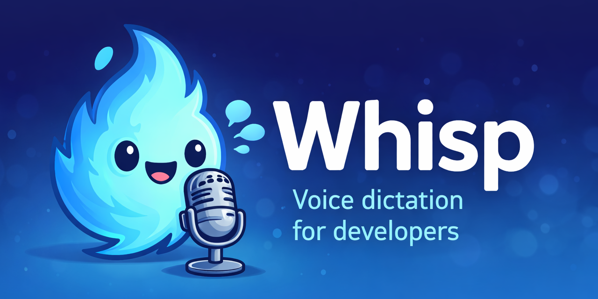

# Whisp



Whisp is a lightweight, **local** voice dictation tool for developers on macOS.

Hold a key → speak → release. Your speech is transcribed by [whisper.cpp](https://github.com/ggml-org/whisper.cpp) (fully offline, no cloud) and pasted wherever your cursor is.

## Features

- **Local & private** — all transcription runs on your machine, nothing leaves it
- **Developer-aware formatting** — `snake_case`, `camelCase`, code symbols, markdown blocks
- **Phonetic corrections** — common mishearings of developer tools auto-corrected (`cube cuddle` → `kubectl`, etc.)
- **Self-learning** — select corrected text and press the learn key; Whisp stores the correction and applies it automatically from then on
- **App-aware** — applies different formatting rules in chat, email, and code apps
- **Configurable hotkeys** — choose your own keys during setup

## Requirements

- macOS (Apple Silicon or Intel)
- [Homebrew](https://brew.sh)

Hammerspoon, whisper.cpp, and all other dependencies are installed automatically.

## Install

```bash
bash <(curl -fsSL https://raw.githubusercontent.com/shreyas-s-rao/whisp/main/install.sh)
```

The installer will ask you to choose:

- A **record key** (default: `F19`) — hold to record, release to transcribe and paste. Supports modifier combos (e.g. `alt+F1`). Avoid `ctrl`/`cmd` — holding them interferes with other shortcuts while recording.
- A **learn key** (default: `F18`) — press after selecting corrected text. Modifier combos work well here (e.g. `ctrl+shift+F1`).
- A **Whisper model** (default: `base.en` — fastest, English only)

Everything is installed into `~/.whisp/`. whisper.cpp is cloned and built there too.  
Your existing Hammerspoon config is untouched — a single `dofile` line is appended to `~/.hammerspoon/init.lua`.

After install, complete the one-time macOS setup below.

## macOS setup (one-time)

These steps are required after the first install.

### 1. Grant Accessibility access

Hammerspoon needs Accessibility permission to simulate the paste keystroke (`⌘V`).

> **System Settings → Privacy & Security → Accessibility → enable Hammerspoon**

### 2. Grant Microphone access

Hammerspoon needs Microphone permission to record audio via `sox`.

> **System Settings → Privacy & Security → Microphone → enable Hammerspoon**

### 3. Reload Hammerspoon config

Click the Hammerspoon icon in the menu bar → **Reload Config**, or press `Cmd+Ctrl+R`.

### 4. Start Hammerspoon at login

So Whisp is always available without manually launching it:

> **System Settings → General → Login Items & Extensions → click + → add Hammerspoon**

## Usage

| Action | Steps |
|--------|-------|
| **Dictate** | Hold record key → speak → release |
| **Correct** | Edit the pasted text → select the correction → press learn key |

### Formatting voice commands

| Say | Result |
|-----|--------|
| `snake foo bar baz` | `foo_bar_baz` |
| `camel foo bar baz` | `fooBarBaz` |
| `open brace` | `{` |
| `close brace` | `}` |
| `open bracket` | `(` |
| `close bracket` | `)` |
| `arrow` | `->` |
| `equals` | `=` |
| `dot` | `.` |
| `code block python` | ` ```python↵↵``` ` |
| `comma`, `period`, `question mark` | `,`  `.`  `?` |
| `k get`, `k logs`, `k apply` | `kubectl get`, `kubectl logs`, `kubectl apply` |

## Learned corrections

Corrections are stored in:

```
~/.whisp/config/vocab.json
```

You can edit this file directly to add, remove, or tweak entries.

## Re-running the installer

Run the install command again at any time to change your hotkeys or switch to a different Whisper model. Your learned corrections are always preserved.

## How it works

```
hold record key
    └─► Hammerspoon records audio via sox → /tmp/dict.wav
release key
    └─► transcribe.sh runs whisper-cli → raw text
         └─► format.py cleans and formats the text
              └─► result is copied to clipboard and pasted
press learn key (with corrected text selected)
    └─► Hammerspoon pipes selection into learn.py
         └─► learn.py diffs against last_raw.txt
              └─► new wrong→correct pairs saved to vocab.json
```

## File layout (after install)

```
~/.whisp/
├── whisper.cpp/          # cloned + built by install.sh
├── config/
│   ├── vocab.json        # learned corrections (grows over time)
│   └── whisper_prompt.txt
├── venv/                 # Python venv with rapidfuzz
├── format.py
├── learn.py
├── transcribe.sh
├── whisp.lua             # loaded by Hammerspoon
├── config.lua            # generated: hotkeys + sox path
├── config.sh             # generated: whisper-cli + model paths
└── last_raw.txt          # last raw transcript (used by learn.py)
```

## Development

To work on Whisp locally, clone the repo and run the installer directly:

```bash
git clone https://github.com/shreyas-s-rao/whisp
cd whisp
./install.sh
```

## Contributing

Whisp is a personal hobby project, built and tested on one machine (Apple Silicon, macOS Sequoia). It almost certainly has rough edges — things may break on different hardware, macOS versions, or Homebrew setups.

Contributions are very welcome, including:

- **Bug reports** — open an issue describing your machine (Apple Silicon / Intel, macOS version) and what went wrong
- **Fixes** — PRs are welcome; keep changes small and focused
- **New voice commands** — additions to `format.py` for new formatting patterns
- **New phonetic corrections** — mishearings you've encountered that aren't handled yet
- **Better whisper_prompt.txt** — words that help Whisper transcribe dev terminology more accurately

### Things that are likely untested

- Intel Macs (different Homebrew prefix — `brew --prefix` should handle it, but not verified)
- macOS versions before Sequoia
- Non-English Whisper models
- Keyboards without F18/F19 keys (you'll need to pick different hotkeys during install)
- Hammerspoon configs that already bind F18/F19

If something doesn't work, check `~/.whisp/debug.log` first — it logs every step of the transcription pipeline.
